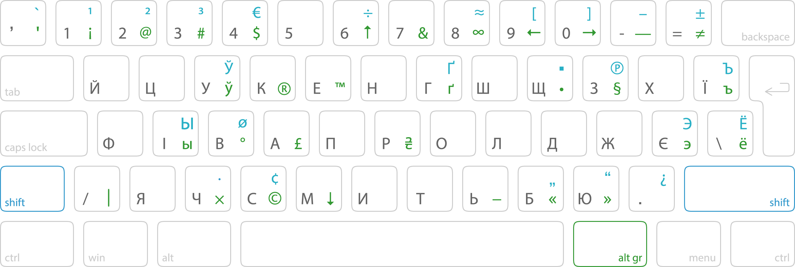
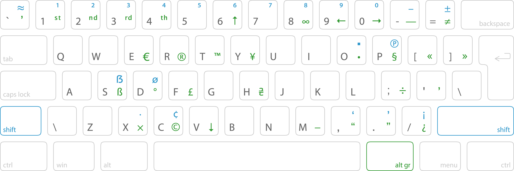

# Типографська розкладка клавіатури для&#160;Windows

## Що це і для кого
Набір типографських розкладок (кирилична і латинська) спрощують введення відсутніх на стандартних розкладках символів. Розкладки для Windows містять основні типографські символи (лапки, тире, коротке тире, типографський апостроф, знаки валют тощо) і часто вживані літери інших абеток.

Якщо ви журналіст або публіцист і хочете писати красиві тексти; айтівець або smm-ник; тримаєте кілька кириличних розкладок; або ви просто педантичний естет — ця розкладка для вас.

Розкладка дозволяє легко вводити додаткові типографські символи через клавішу `Alt`, а також позбавляє необхідності тримати ще одну розкладку (наприклад, російську чи білоруську) в разі якщо вам потрібні літери інших слов’янських мов.

Додаткові символи латинської розкладки в основному співпадають з кириличною версією. Деякі відмінності пов’язані з особливостями англійської пунктуації і різними призначеннями розкладок.

## Чіт-шит
###### Кирилична розкладка

###### Латинська розкладка

Символи, що позначені 🟢 зеленим — вводяться через `Alt`+`відповідна клавіша`, 🔵 синім — через `Alt`+`Shift`+`відповідна клавіша`.

__Зверніть увагу:__ додаткові символи вводяться через `правий Alt` (він же `Alt Gr`). Windows не дозволяє вводити альтернативні символи через `лівий Alt`, що може бути незручним для деяких користувачів — тому нижче є інструкція з додавання такої можливості.

## Особливості розкладки
- Швидке введення типографських знаків (довге і коротке тире `— –`, лапки `« » „ “`, правильний апостроф у вигляді краплі `’`, знаки градуса `°`, параграфа `§`, гривні та інших валют `₴ $ ¢ € £`, маркери списків `• ▪`, часто вживані математичні символи `× ⋅ ÷ − ± ≠ ≈` та інше).
- Можливість введення літер інших кириличних абеток `ы ъ э ў` тощо. __Позбудьтеся нарешті зоопарку розкладок__, достатньо англійської та типографської української на всі випадки!
- Інтуїтивне розташування альтернативних символів.
- В українській розкладці за замовчанням використовується типографський апостроф замість звичайного машинописного (який можна ввести через `правий Alt`). В англійській — навпаки (для зручного використання розкладки у, наприклад, програмуванні).
- Швидкий доступ до спецсимволів (на кшталт `@ # $ & [ ]` та інших) без необхідності перемикатися на англійську розкладку.
- Можливість ставити стрілочки `← ↑ → ↓`.
- Якщо у вас основна кирилична розкладка не українська — існує версія розкладки, де літери `ы ъ э ё` знаходяться в основному наборі, а українські — в альтернативному.

## Як встановити
- Завантажте останні версії файлів `Ukr-Typo-Keyboard-Win.zip` та `Eng-Typo-Keyboard-Win.zip` зі [сторінки релізів](https://github.com/devich/typokbd/releases/latest).
- Розпакуйте архів розкладки і запустіть `setup.exe`. Зробіть це для кожної потрібної вам розкладки.
- Перезавантажте Windows.
- Оберіть в настройках мови та регіону Windows розкладку `Ukrainian (Typography)` для української мови і `English (typograpy)` для англійської.
- Видаліть більше непотрібні інші розкладки.

## Як зробити лівий Alt клавішею для вводу альтернативних символів
Архіви з розкладками зі [сторінки релізів](https://github.com/devich/typokbd/releases/latest) містять в собі також два `.reg` файли: `Alts-Swap.reg` і `Alts-Restore-Defaults.reg`.

- Щоб поміняти місцями функції правого та лівого `Alt` — запустіть `Alts-Swap.reg`.
- Щоб повернути все як і було — запустіть `Alts-Restore-Defaults.reg`.
- Після внесення змін до реєстру перезавантажте Windows.

Альтернативний метод: можна скористатися застосунком [SharpKeys](https://github.com/randyrants/sharpkeys) — він дозволяє змінювати функції будь-яких клавіш у Windows через графічний інтерфейс.

__Зверніть увагу:__ якщо ви поміняєте місцями альти, то перемикання розкладки по `Alt`+`Shift` зліва не працюватиме. Використовуйте `Ctrl`+`Shift` (також `Win`+`Пробіл`) для перемикання або ставте альтернативні символи через `правий Alt`.